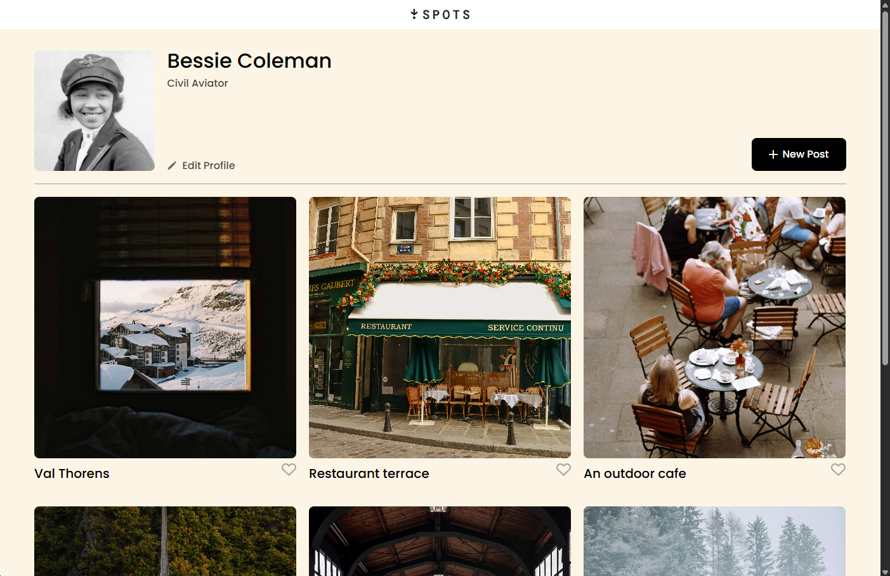
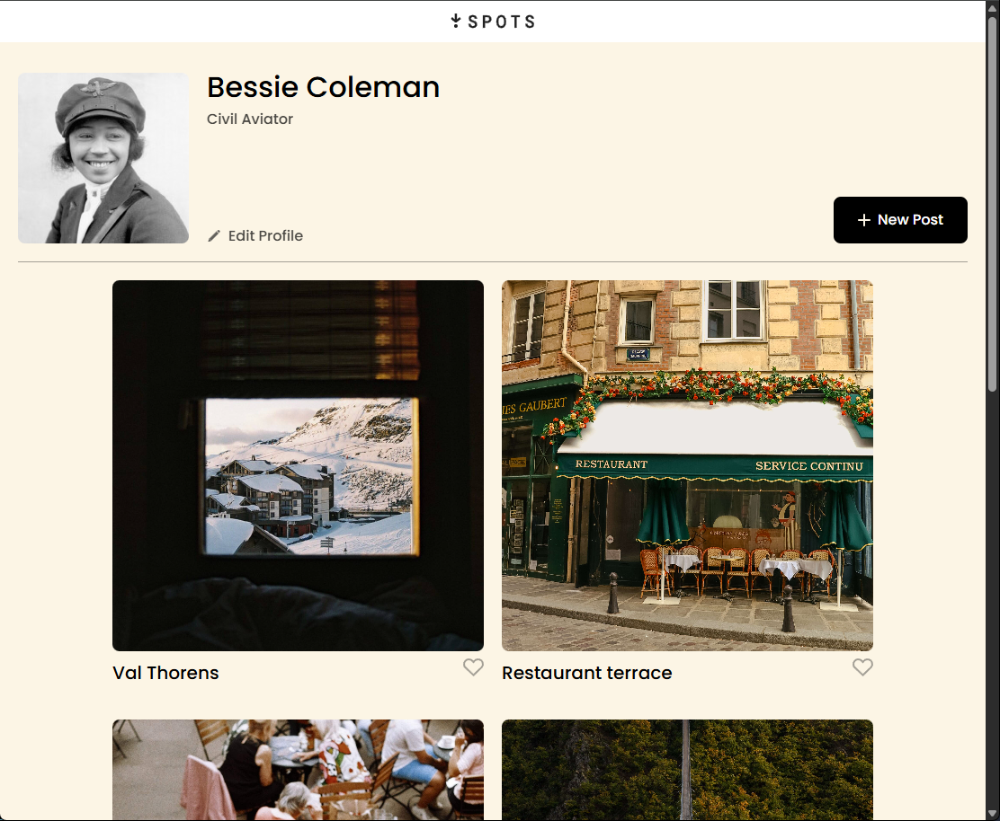
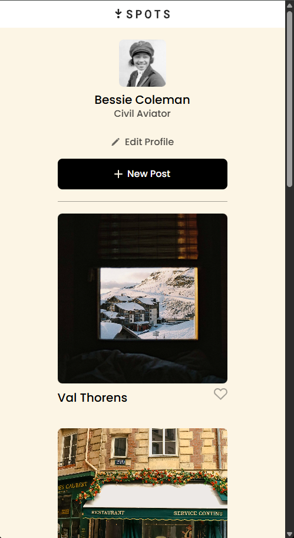

# 📍 Spots

> A visually engaging photo gallery inspired by travel, cafés, and architecture—complete with profile customization and interactive features.

---

## 📝 Description

**Spots** is a static web project designed to showcase visually rich photo cards. Users in the future will be able to interact with the interface by liking posts and editing their profile to their liking such as editing name, bio, and or adding more posts to their page.

This project serves as a UI/UX demo, emphasizing clean layout design, responsive sections, and user-friendly interaction components such as "Edit Profile" and "New Post" buttons.

---

## 🚀 Features

- User profile section with avatar, name, and editable bio
- Dynamic-looking gallery cards with location names and like buttons
- Responsive layout using Flexbox/Grid
- Clean and semantic HTML structure
- Visual hierarchy supported by organized CSS and class structure

---

## 🛠️ Technologies & Techniques

- **HTML5**: Semantic and accessible markup
- **CSS3**: Custom styles, layout via Flexbox, BEM naming convention
- **Normalize.css**: For consistent styling across browsers
- **Responsive Design**: Designed to adapt visually across devices
- **Static Deployment**: Hosted via GitHub Pages

---

## 🖼️ Visuals

Desktop View: 
Tablet View: 
Mobile: 

## 🌐 Live Demo

[🔗 View on GitHub Pages](https://ryanscode-hue.github.io/se_project_spots/)

---
